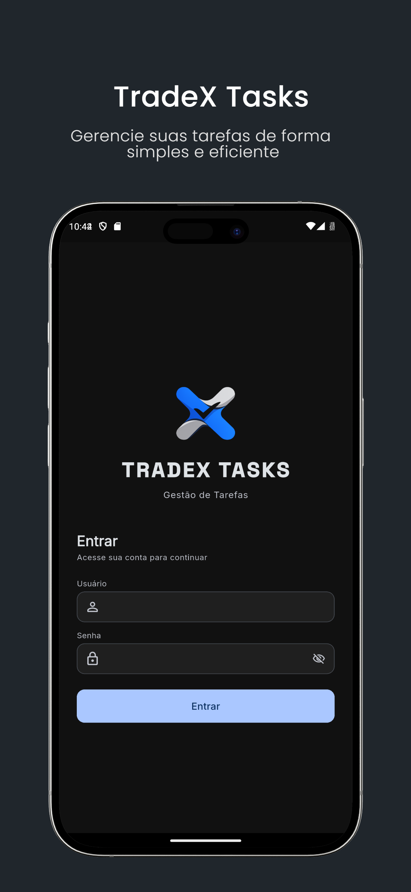
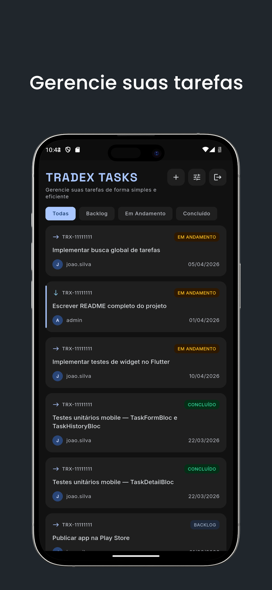
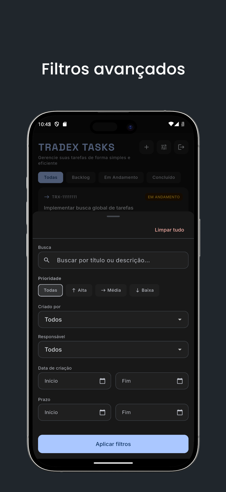
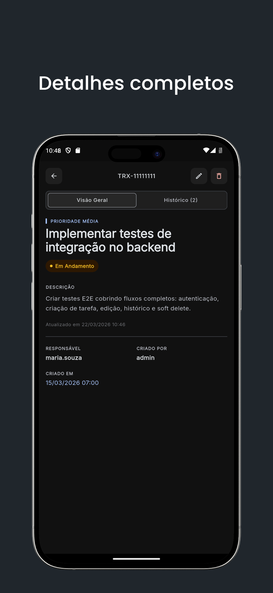
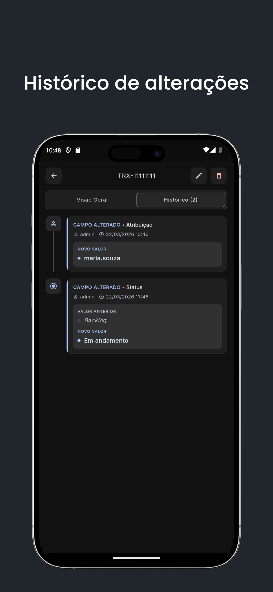

<div align="center">
  
  <h1>TradeX Tasks</h1>
  <p>Sistema fullstack de gestão de tarefas com API REST em Django e aplicativo mobile em Flutter.</p>

  
  
  
  
</div>

---

## Telas

<table>
  <tr>
    <td align="center"><b>Autenticação</b></td>
    <td align="center"><b>Lista de tarefas</b></td>
    <td align="center"><b>Filtros avançados</b></td>
    <td align="center"><b>Detalhes</b></td>
    <td align="center"><b>Histórico</b></td>
  </tr>
  <tr>
    <td></td>
    <td></td>
    <td></td>
    <td></td>
    <td></td>
  </tr>
</table>

---

## Stack

| Camada | Tecnologias |
|---|---|
| **Backend** | Django REST Framework · JWT · PostgreSQL · Docker |
| **Mobile** | Flutter · BLoC · Clean Architecture · Freezed · Dio |
| **Docs** | drf-spectacular · Swagger UI · ReDoc |

---

## Estrutura do repositório

```
/
├── backend/       # API Django REST Framework
├── mobile/        # App Flutter
└── docs/          # Documentação e assets
```

---

## Como rodar

### 1. Backend

O backend roda inteiramente via Docker. Com o Docker instalado, execute:

```bash
cd backend
cp .env.example .env
docker compose up --build
```

As migrations são aplicadas automaticamente e o banco é populado com dados de teste.
A API ficará disponível em `http://localhost:8000/api`.

**Usuários criados pelo seed:**

| Usuário | Senha |
|---|---|
| `admin` | `admin123` |
| `alice` | `alice123` |
| `bob` | `bob123` |

### 2. Mobile

Com o backend rodando, configure o endereço da API:

```bash
cd mobile
cp .env.example .env
```

Edite o `.env` com o IP da sua máquina na rede local:

```env
API_BASE_URL=http://<SEU_IP>:8000/api
```

> Use o IP da rede local (ex: `192.168.1.x`), não `localhost` — o app roda no dispositivo ou emulador e não acessa o host diretamente.

```bash
flutter pub get
flutter run
```

---

## Variáveis de ambiente

### Backend — `backend/.env`

| Variável | Descrição | Padrão |
|---|---|---|
| `SECRET_KEY` | Chave secreta do Django | — |
| `DEBUG` | Modo de depuração | `True` |
| `DJANGO_SETTINGS_MODULE` | Módulo de configurações | `config.settings.development` |
| `DB_NAME` | Nome do banco | `tradex` |
| `DB_USER` | Usuário do banco | `tradex` |
| `DB_PASSWORD` | Senha do banco | `tradex` |
| `DB_HOST` | Host do banco | `localhost` |
| `DB_PORT` | Porta do banco | `5432` |

### Mobile — `mobile/.env`

| Variável | Descrição |
|---|---|
| `API_BASE_URL` | URL base da API (ex: `http://192.168.1.x:8000/api`) |

---

## Endpoints da API

| Método | Endpoint | Descrição |
|---|---|---|
| `POST` | `/api/auth/login/` | Autenticação |
| `POST` | `/api/auth/refresh/` | Renovação do token |
| `POST` | `/api/auth/logout/` | Logout |
| `GET` | `/api/auth/me/` | Dados do usuário autenticado |
| `GET` | `/api/users/` | Lista de usuários |
| `GET` | `/api/tarefas/` | Listar tarefas (com filtros e paginação) |
| `POST` | `/api/tarefas/` | Criar tarefa |
| `GET` | `/api/tarefas/{id}/` | Detalhar tarefa |
| `PATCH` | `/api/tarefas/{id}/` | Atualizar tarefa |
| `DELETE` | `/api/tarefas/{id}/` | Remover tarefa (soft delete) |
| `GET` | `/api/tarefas/{id}/historico/` | Histórico de alterações |
| `GET` | `/api/schema/` | Schema OpenAPI (YAML) |
| `GET` | `/api/docs/` | Documentação interativa (Swagger UI) |
| `GET` | `/api/redoc/` | Documentação alternativa (ReDoc) |

---

## Decisões técnicas

### Histórico de alterações

O histórico é implementado via override do `save()` no modelo `Task`. Antes de salvar, o método busca o estado atual no banco e compara campo a campo com os novos valores — gerando um registro em `TaskHistory` para cada campo alterado, com valor anterior, valor novo, usuário responsável e timestamp.

Essa abordagem foi escolhida por centralizar a lógica de auditoria no modelo, sem depender de signals (que tornam o fluxo implícito) nem de mixins de serializer (que não capturam alterações feitas fora da API). Para evitar falsos positivos com campos `datetime` causados por diferença de timezone entre Python e PostgreSQL, os valores são normalizados para UTC antes da comparação.

### Soft delete

Tarefas não são removidas fisicamente do banco. O modelo `Task` herda de `SoftDeleteModel` (em `apps/core/models.py`), que sobrescreve o `delete()` para preencher `deletado_em` e filtra registros deletados no manager padrão. O endpoint `DELETE /api/tarefas/{id}/` realiza soft delete, preservando o histórico de alterações associado.

### Status concluído é irreversível

Uma tarefa que atinge o status `concluido` não pode ter o status alterado novamente. A regra é aplicada em duas camadas: no serializer do backend (`validate_status`), que retorna erro 400 para qualquer tentativa de mudança via API, e no frontend, onde as opções de status são bloqueadas visualmente e um snackbar informa o usuário ao tentar interagir.

### Arquitetura BLoC no mobile

O app segue Clean Architecture com três camadas bem definidas:

- **Domain** — entidades puras (`Task`, `User`) e contratos de repositório, sem dependência de Flutter ou pacotes externos
- **Data** — implementação dos repositórios, modelos com `Freezed` + `JsonSerializable` para deserialização da API
- **Presentation** — BLoCs isolados por funcionalidade (`AuthBloc`, `TaskListBloc`, `TaskDetailBloc`, `TaskFormBloc`, `TaskHistoryBloc`), com estados e eventos modelados com `Freezed`

O `AuthBloc` é registrado como singleton no `get_it` para que o interceptor de rede consiga disparar o evento `sessionExpired` ao detectar falha no refresh token, deslogando o usuário de qualquer ponto da aplicação.

### Refresh token automático

O `AuthInterceptor` intercepta respostas `401` e tenta renovar o access token via `/auth/refresh/` usando uma instância separada do Dio (para evitar loop infinito via flag `_retry`). Se o refresh falhar, os tokens são removidos e `sessionExpired` é disparado no `AuthBloc`. Requisições sem token não disparam `sessionExpired` — apenas passam o erro adiante.

### Diferenciais implementados

- **PostgreSQL** no lugar de SQLite, com serviço dedicado no Docker Compose
- **ActionSerializerMixin** em `apps/core/mixins.py` — mapeia actions do `ModelViewSet` para serializers específicos via dicionário, eliminando o boilerplate de `get_serializer_class()` em cada ViewSet
